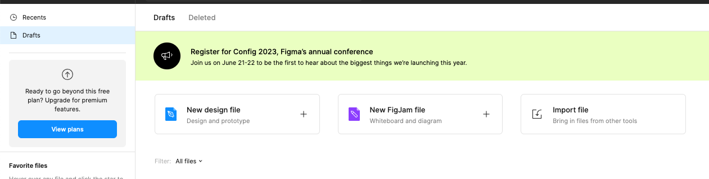
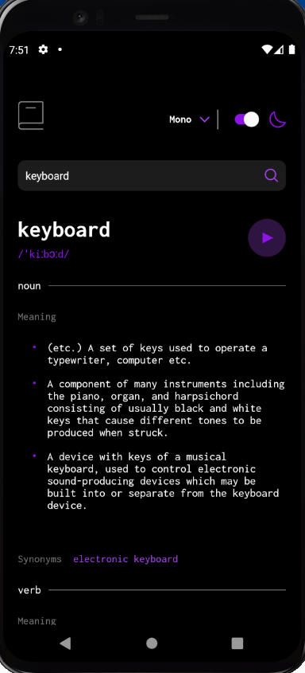

# WordWise

This project is a mobile development course assignment where I am tasked with implementing the UI and the functionalities outlined below.

## Design

The design requirement is open-ended to some extent. You will find the corresponding web application below and the design target below:

You can also find the complete figma file of the design of the corresponding web application in `design/dictionary-web-app.fig`. To see the figma file, you will need to create an account at https://www.figma.com/, and load this given file in figma via “Import file”.

Essentially, you should try your best to retain the same design for the home screen in your application. The home screen should load a word and its definitions and pronunciation as a demo for users (e.g., keyword). In addition, you will remove the font selection and theme selection from the home screen, and prepare two new screens for users:

- One of those screens will be for users to change fonts (font selection)
- The other screen will be for users to change the theme (theme selection)

Users of your app should be able to navigate freely among the three screens.

## Functionality

You will use the Free Dictionary API: https://dictionaryapi.dev/.

Your users should be able to:

- Search for words using the input field
- See the Free Dictionary API's response for the searched word
- See a form validation message when trying to submit a blank form
- Play the audio file for a word when it's available
- Switch between serif, sans serif, and monospace fonts
- Switch between light and dark themes
- View the optimal layout for the interface depending on their device's screen size
- See hover and focus states for all interactive elements on the page

Please note:

- The API will sometimes return multiple items for a word, phonetics, and audio file. Choose to handle this however you feel is best.

In addition to the above operations, you should also implement the test cases to cover most components and most possible user interactions. A good starting point is to think about the above operations and how they can be triggered by the user.

## To do

When you finish, please do the following:

1. design and develop the application
1. add your tests to cover every component and every possible user interaction
1. commit and push your code
1. add your name to this README file (see above)
1. capture how your app looks locally in the simulated app on your machine
1. put the captured image in the design folder
1. edit this README file to display your captured image here in this README file (see the above displayed expected design as an example)
